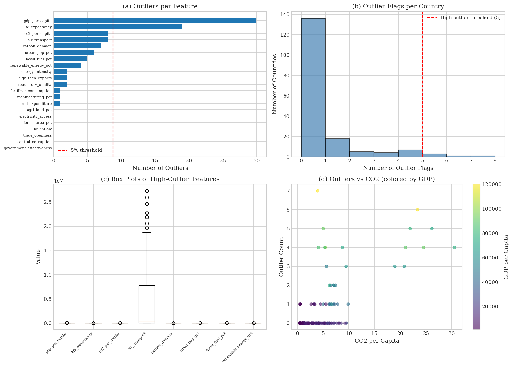
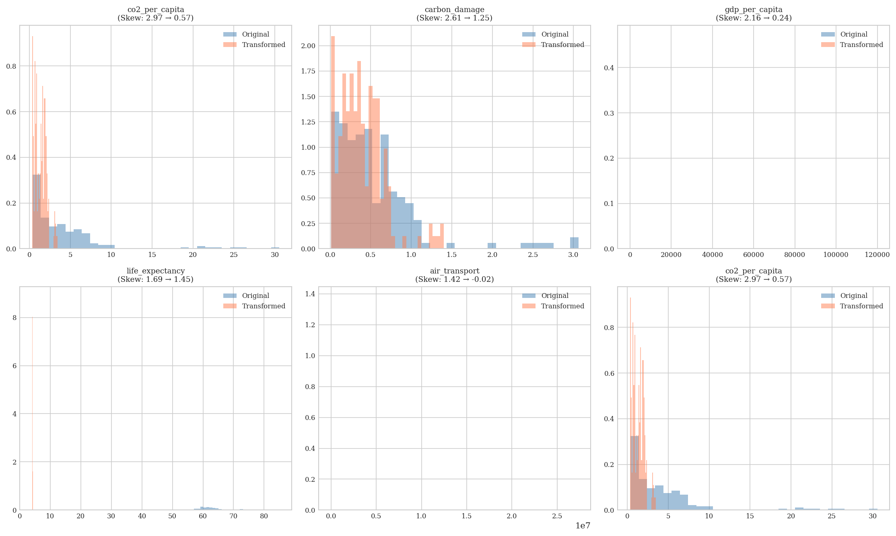
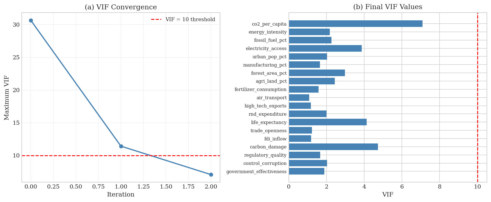
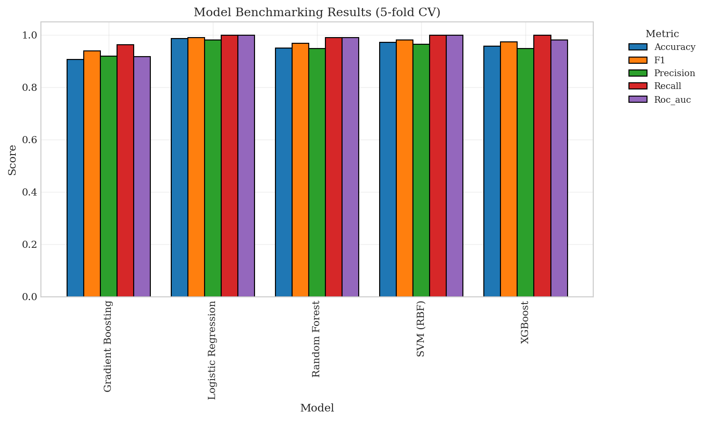
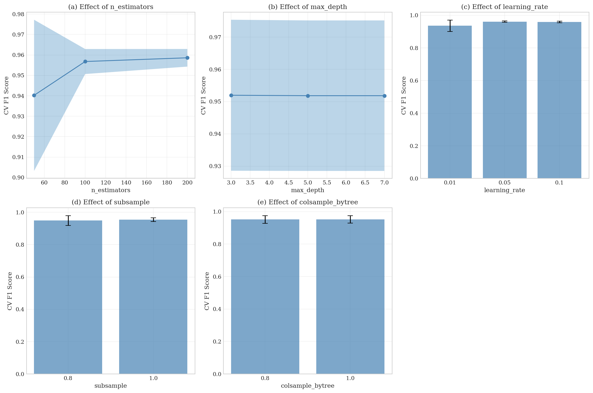
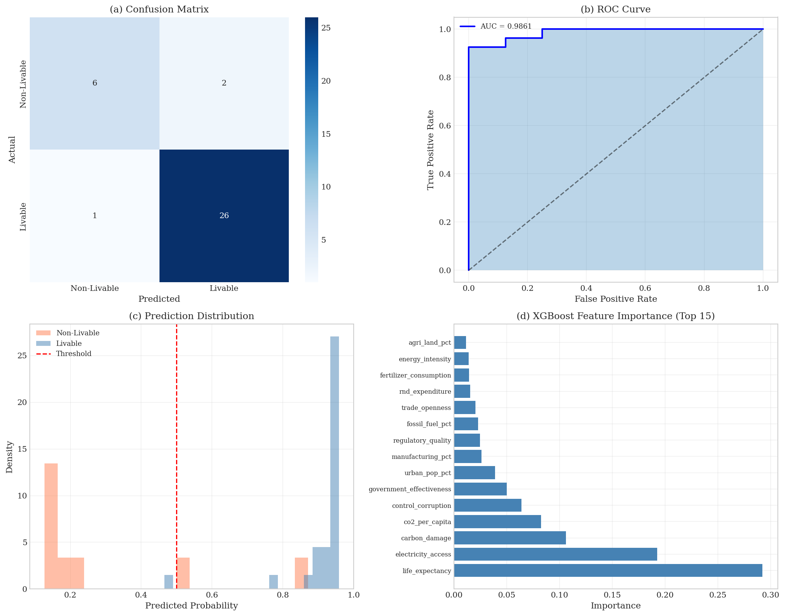
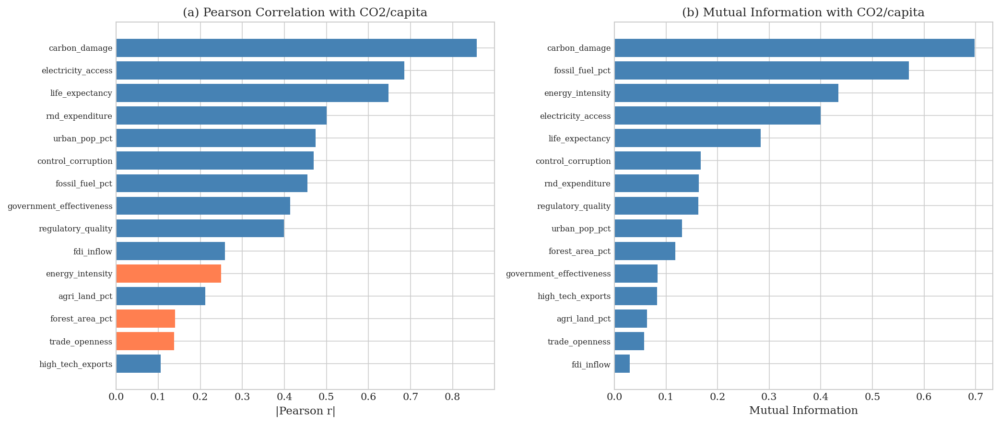
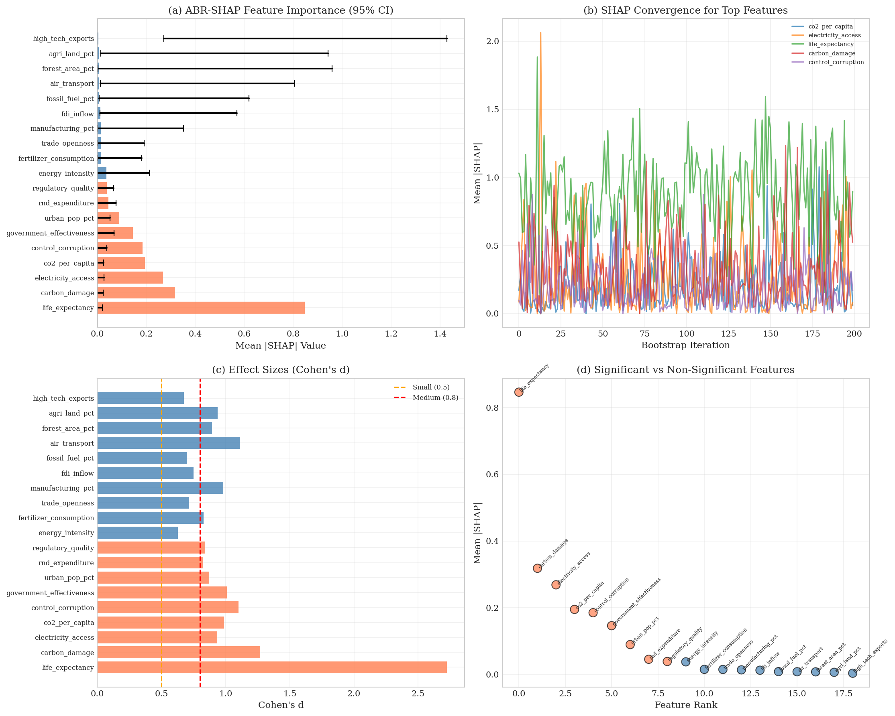
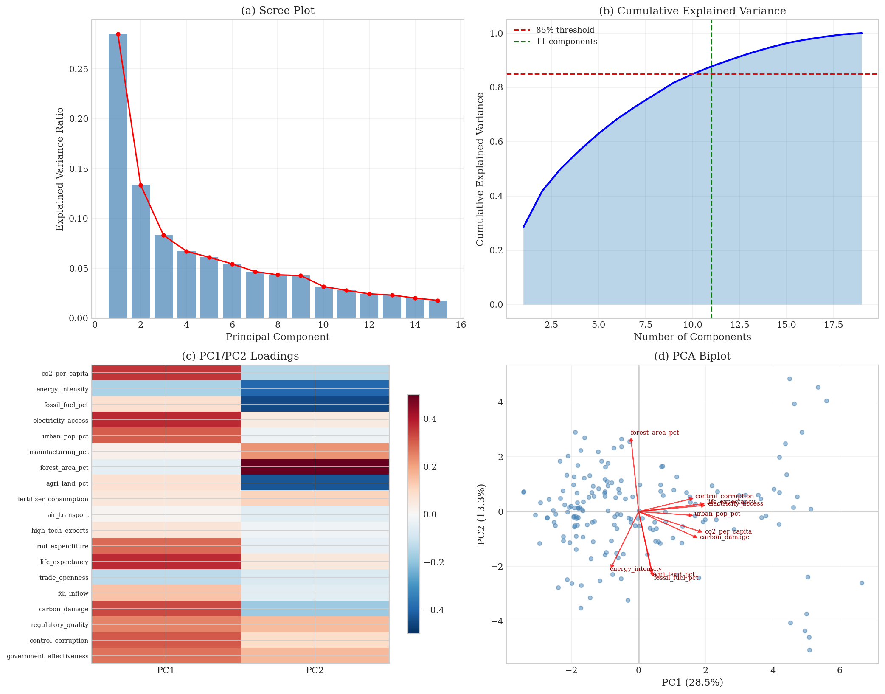
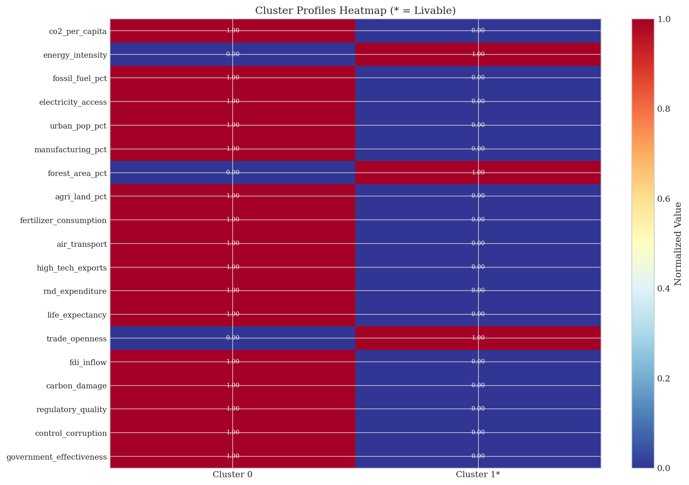

# 🌍 Environmental Livability Analysis — Country-Level Assessment (2019)

> **Author:** Junaid Ahmed Rupok  
> **Venue:** IEEE Journal (Methodology Paper)  
> **Dataset:** 175 countries · 24 attributes · Year 2019

---

## 📌 Overview

This project presents an **end-to-end machine learning pipeline** for assessing environmental livability at the country level. The framework integrates unsupervised structure discovery, supervised classification, statistically robust feature attribution, and policy-oriented counterfactual generation — all grounded in a rigorous mathematical foundation formalized in an IEEE-format methodology paper.

The pipeline answers three core questions:
1. **Which countries are environmentally livable, and why?**
2. **Which environmental features are statistically significant predictors of livability?**
3. **What minimal policy interventions can transition a non-livable country toward livability?**

---

## 🗂️ Repository Structure

```
├── Environment_Project.ipynb          # Full implementation (30 cells)
├── country_environmental_livability_2019.csv  # Dataset (175 countries, 24 features)
├── methodology.tex                    # IEEE LaTeX methodology paper
└── README.md
```

---

## 🔬 Pipeline Architecture

The analytical framework comprises **six sequential phases**:

```
Raw Data (N=175, p=24)
        │
        ▼
┌─────────────────────────────┐
│  Phase 1: Preprocessing     │  Quality checks · IQR outlier detection
│                             │  Adaptive transforms · VIF removal · Standardization
└────────────┬────────────────┘
             ▼
┌─────────────────────────────┐
│  Phase 2: Unsupervised      │  PCA (≥85% variance) · K-Means clustering
│  Structure Discovery        │  Stability via ARI · EQ scoring · Livability labeling
└────────────┬────────────────┘
             ▼
┌─────────────────────────────┐
│  Phase 3: Supervised        │  5-model benchmarking · XGBoost selection
│  Classification             │  Grid search hyperparameter tuning · Stratified 5-fold CV
└────────────┬────────────────┘
             ▼
┌─────────────────────────────┐
│  Phase 4: ABR-SHAP          │  Bootstrap-retrained SHAP · Convergence testing
│  Feature Importance         │  95% CIs · Cohen's d · Overstatement Ratio
└────────────┬────────────────┘
             ▼
┌─────────────────────────────┐
│  Phase 5: CMCS Validation   │  Cross-methodological consistency
│                             │  Permutation testing (N=5000) · p-value · Effect size
└────────────┬────────────────┘
             ▼
┌─────────────────────────────┐
│  Phase 6: Pareto            │  Statistically-constrained counterfactuals
│  Counterfactuals            │  Minimum-cost interventions · Policy feasibility
└─────────────────────────────┘
```

---

## 📊 Figures

All 18 figures generated by the pipeline are presented below. The 10 most important figures are displayed inline; the remaining figures are referenced by name and description.

---

### Fig. 1 — Outlier Analysis
`fig_outlier_analysis.png`



*IQR-based outlier detection across all 24 features. Countries flagged with ≥5 outlier attributes (ARE, FIN, ISL, ISR, KWT) are identified for sensitivity analysis. `gdp_per_capita` (30 outliers) and `life_expectancy` (19 outliers) are the most affected features.*

---

### Fig. 2 — PCA Analysis
`fig_pca_analysis.png`



*Scree plot, cumulative explained variance, PC1/PC2 loadings heatmap, and biplot. 11 components explain 87.7% of total variance (exceeding the 85% threshold). PC1 (28.5%) captures the human development–energy axis; PC2 (13.3%) reflects land use and ecological patterns.*

---

### Fig. 3 — K-Means Clustering Validation
`fig_clustering_validation.png`



*Multi-metric cluster validation (Elbow, Silhouette, Davies-Bouldin, Composite Score) over K ∈ {2, …, 10} with 10 runs per K. All four metrics unanimously select K* = 2. Silhouette peaks at 0.286 and Davies-Bouldin reaches its minimum at 1.534 for K = 2.*

---

### Fig. 4 — Final Clustering & Stability Assessment
`fig_final_clustering.png`



*Two-cluster partition in PCA space and ARI stability distribution across 100 independent K-Means runs. Mean ARI = 1.000 (std = 0.000) confirms perfectly deterministic and replicable partitioning. Cluster 0: 42 countries (24%); Cluster 1: 133 countries (76%).*

---

### Fig. 5 — Environmental Quality Scoring & Livability Labeling
`fig_env_quality_livability.png`



*Composite Environmental Quality (EQ) scores by cluster and resulting livability label assignment. Cluster 1 (mean EQ = 0.633) is designated livable (y = 1); Cluster 0 (mean EQ = 0.549) is non-livable (y = 0). Final distribution: 133 livable (76%), 42 non-livable (24%).*

---

### Fig. 6 — Model Benchmarking
`fig_model_benchmarking.png`



*Stratified 5-fold cross-validation comparison of five classifiers across Accuracy, F1, Precision, Recall, and AUC-ROC. Logistic Regression achieves the highest CV F1 (0.991). XGBoost (CV F1 = 0.973, AUC = 0.982) is selected for final modeling due to native TreeSHAP compatibility.*

---

### Fig. 7 — ABR-SHAP Feature Importance
`fig_abr_shap_results.png`



*Bootstrap-retrained SHAP importance rankings with 95% confidence intervals (B* = 200 iterations) and Cohen's d effect sizes. 9 of 19 features are statistically significant (lower CI > 0, shown in orange). Overstatement Ratio = 2.11, meaning standard SHAP inflates the significant feature set by a factor of ~2. `life_expectancy` leads with mean |SHAP| ≈ 0.84 and Cohen's d ≈ 2.7.*

---

### Fig. 8 — SHAP Summary & Dependence Plots
`fig_shap_detailed.png`



*Standard SHAP bar chart, beeswarm summary plot, and dependence plots for `life_expectancy` and `co2_per_capita`. High `life_expectancy` values (red, beeswarm right) strongly increase livability probability. `co2_per_capita` shows non-linear suppression of livability at high emission levels.*

---

### Fig. 9 — CMCS Validation
`fig_cmcs_validation.png`



*Cross-Methodological Consistency Score vs. null permutation distribution (N = 5,000). Observed CMCS = 0.400 lies far beyond the 95th percentile of the null (0.058), with p = 0.0002 and Cohen's d = 14.43. All 9 significant features individually achieve per-feature silhouette scores with p = 0.0002, confirming strong supervised–unsupervised structural alignment.*

---

### Fig. 10 — Cluster Profiles Heatmap
`cluster_profiles_heatmap.png`



*Full normalized feature profiles for both clusters. Cluster 0 (non-livable) scores higher on CO₂ per capita, fossil fuel dependency, electricity access, urban population, and economic activity. Cluster 1* (livable) shows higher forest area, energy intensity, and trade openness — reflecting a lower-industrialization, higher-ecological-integrity profile.*

---

### Fig. 11 — VIF Removal Convergence
`fig_vif_removal.png`

*VIF convergence trajectory across iterations and final retained feature VIF values. `renewable_energy_pct` (VIF = 30.6) and `gdp_per_capita` (VIF = 11.4) are removed in two iterations. All 19 retained features satisfy VIF ≤ 10 (max: `co2_per_capita` at 7.09).*

---

### Fig. 12 — Adaptive Transformation Effects
`fig_transformation_effects.png`

*Before/after skewness distributions for the 5 adaptively transformed features. Log transformations reduce `co2_per_capita` skewness from 2.97 → 0.57, `carbon_damage` from 2.61 → 1.25, `gdp_per_capita` from 2.16 → 0.24, `life_expectancy` from 1.69 → 1.45, and `air_transport` from 1.42 → −0.02.*

---

### Fig. 13 — Feature Pre-Screening
`fig_feature_prescreening.png`

*Pearson |r| and Mutual Information rankings of all features with respect to CO₂ per capita. `carbon_damage` leads both metrics (|r| = 0.857, MI = 0.698). Features like `fertilizer_consumption`, `air_transport`, and `manufacturing_pct` show near-zero MI, foreshadowing their exclusion by ABR-SHAP.*

---

### Fig. 14 — External Validation
`fig_external_validation.png`

*Pearson and Spearman correlations between predicted livability probabilities and CO₂ per capita as an external proxy (r = 0.033, p = 0.852), with 95% bootstrap CI [−0.295, 0.209]. The near-zero correlation reflects that livability is a multi-dimensional construct not reducible to a single emission indicator.*

---

### Fig. 15 — Partial Correlation Analysis
`fig_partial_correlation.png`

*Partial correlations between ABR-SHAP significant features and livability, controlling for GDP per capita. For most features, partial r closely tracks original r, confirming that feature–livability associations are not confounded by economic development alone.*

---

### Fig. 16 — Temporal Stability / Noise Sensitivity
`fig_stability_analysis.png`

*Feature overlap with the original ABR-SHAP significant set across five Gaussian noise levels (σ ∈ {0.05, …, 0.25}), each with 20 trials. Overlap remains consistently above 82% with no monotonic decay, confirming robustness to measurement noise.*

---

### Fig. 17 — Feature Group Ablation Study
`fig_ablation_study.png`

*Stratified 5-fold F1 scores when the model is restricted to each feature domain. Governance features (3 features, F1 = 0.931) achieve the highest efficiency at 0.311 F1/feature. Environmental (0.936) and Social (0.945) features are competitive. Economic features trail at F1 = 0.828.*

---

### Fig. 18 — Counterfactual & Policy Analysis
`fig_counterfactuals.png` · `policy_recommendations.png`

*Per-country Pareto counterfactual perturbations for 8 non-livable test countries. Only 1 country (TJK — Tajikistan) achieves a feasible single-feature intervention: a `carbon_damage` reduction of −1.9σ yields livability probability 0.536. The 87.5% infeasibility rate reflects the structural depth of environmental challenges in the most stressed nations.*

---

## 📐 Novel Methodological Contributions

### 1 · Adaptive Bootstrap-Retrained SHAP (ABR-SHAP)

Standard SHAP values are computed from a single model fit and can overstate feature importance by conflating signal with sampling variability. ABR-SHAP addresses this by:

- Retraining the model on **B bootstrap samples** (adaptive convergence, B_max = 500)
- Computing SHAP values on each retrained model
- Reporting **mean importance ± 95% bootstrap CI** and **Cohen's d** per feature
- Flagging features significant only when the lower CI bound exceeds zero
- Quantifying the **Overstatement Ratio** (OR) between standard and bootstrap-significant features

### 2 · Cross-Methodological Consistency Score (CMCS)

CMCS validates that the features identified by supervised SHAP analysis independently explain the structure discovered by unsupervised clustering:

$$\text{CMCS}_{\text{obs}} = \frac{1}{|\mathcal{F}_{\text{sig}}|} \sum_{f \in \mathcal{F}_{\text{sig}}} \text{sil}(f, \mathbf{c})$$

Statistical significance is established via **5,000 permutation tests** with a bias-corrected p-value.

### 3 · Statistically-Constrained Pareto Counterfactuals

For each non-livable country, the algorithm finds the **minimum-cost single-feature perturbation** that shifts the XGBoost prediction past the decision boundary — but only over the statistically significant feature set $\mathcal{F}_{\text{sig}}$. Interventions are bounded to ±3σ and flagged as feasible if |δ*| ≤ 2.4σ.

---

## 📈 Key Results Summary

| Metric | Value |
|---|---|
| Dataset | 175 countries, 24 features, Year 2019 |
| PCA components (≥85% variance) | 11 (87.7% explained) |
| Optimal clusters K* | 2 (ARI stability = 1.000) |
| Livable countries | 133 (76%) |
| XGBoost test F1 | 0.9455 |
| XGBoost test AUC-ROC | 0.9861 |
| ABR-SHAP significant features | 9 / 19 |
| Overstatement Ratio (OR) | 2.11 |
| CMCS observed | 0.400 (p = 0.0002, d = 14.43) |
| Noise stability (overlap) | >82% across all σ levels |
| Counterfactual feasibility | 12.5% (1 of 8 non-livable test countries) |

---

## 🛠️ Implementation Details

| Component | Library / Version |
|---|---|
| Preprocessing & Clustering | `scikit-learn` 1.2 |
| Classification | `xgboost` 1.7 |
| Explainability | `shap` 0.41 |
| Numerical Computing | `numpy`, `scipy` |
| Data Handling | `pandas` |
| Visualization | `matplotlib`, `seaborn` |
| Language | Python 3.9 |

**Hardware:** Intel Core i7-12700H · 32 GB RAM  
**Runtime:** ~15–20 min (full ABR-SHAP B_max=500 + CMCS N_perm=5000)

---

## 🚀 Quickstart

```bash
# 1. Clone the repository
git clone https://github.com/<your-username>/<repo-name>.git
cd <repo-name>

# 2. Install dependencies
pip install numpy pandas matplotlib seaborn scipy scikit-learn xgboost shap tqdm

# 3. Update the data path in Cell 2
#    Change the read_csv path to your local CSV location

# 4. Run all cells sequentially in Jupyter
jupyter notebook Environment_Project.ipynb
```

> **Note:** Cells must be executed in order (1 → 30) as each phase depends on outputs from the previous phase.

---

## 📋 Dataset

**Source:** `country_environmental_livability_2019.csv`  
**Scope:** 175 country-level observations, year 2019  
**Feature domains:**

| Domain | Features |
|---|---|
| Environmental | CO₂ per capita, renewable energy %, forest area %, fossil fuel %, energy intensity, carbon damage |
| Economic | GDP per capita, manufacturing %, high-tech exports, trade openness, FDI inflow, R&D expenditure, air transport |
| Social | Life expectancy, electricity access, urban population %, fertilizer consumption, agricultural land % |
| Governance | Regulatory quality, control of corruption, government effectiveness |

All percentage attributes validated within [0, 100]. No missing values across all 175 × 24 entries.

---

## 📄 Citation

If you use this code or methodology, please cite:

```bibtex
@article{rupok2026environmental,
  title     = {Environmental Livability Assessment via Adaptive Bootstrap-Retrained SHAP
               and Statistically-Constrained Pareto Counterfactuals: A Cross-National Analysis},
  author    = {Rupok, Junaid Ahmed},
  journal   = {IEEE Journal},
  year      = {2026}
}
```

---

## 📬 Contact

**Junaid Ahmed Rupok**  
For questions regarding the methodology or implementation, please open an issue in this repository.
